# Day 3 Task: Basic Linux Commands with a Twist

Task: What are the Linux commands to

1. View the content of a file and display line numbers.

2. Change the access permissions of files to make them readable, writable, and executable by the owner only.
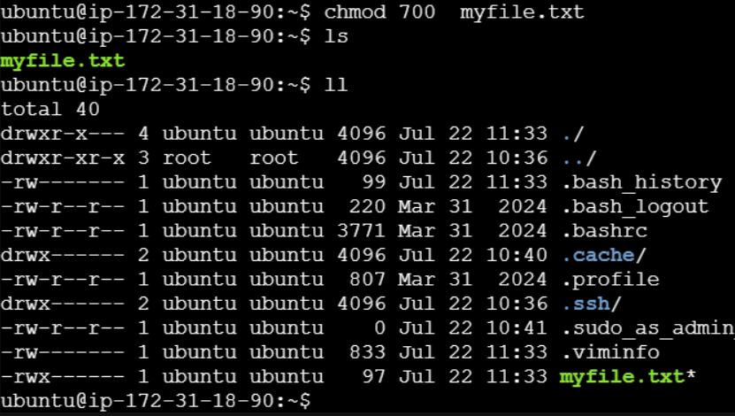

3. Check the last 10 commands you have run.
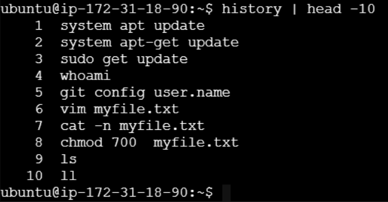

4. Remove a directory and all its contents.
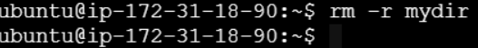

5. Create a `fruits.txt` file, add content (one fruit per line), and display the content.
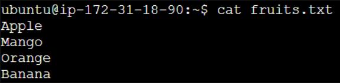

6. Add content in `devops.txt` (one in each line) - Apple, Mango, Banana, Cherry, Kiwi, Orange, Guava. Then, append "Pineapple" to the end of the file.
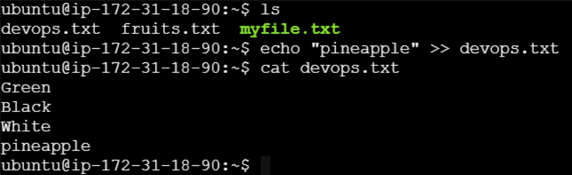

7. Show the first three fruits from the file in reverse order.
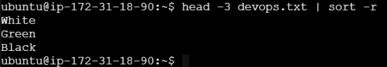

8. Show the bottom three fruits from the file, and then sort them alphabetically.
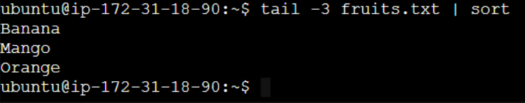

9. Create another file `Colors.txt`, add content (one color per line), and display the content.
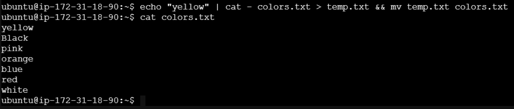

10. Add content in `Colors.txt` (one in each line) - Red, Pink, White, Black, Blue, Orange, Purple, Grey. Then, prepend "Yellow" to the beginning of the file.
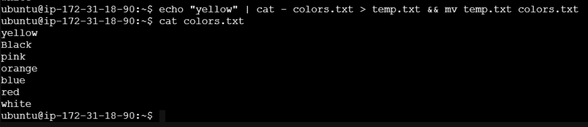

11. Find and display the lines that are common between `fruits.txt` and `Colors.txt`.
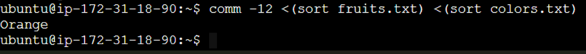

12. Count the number of lines, words, and characters in both `fruits.txt` and `Colors.txt`.
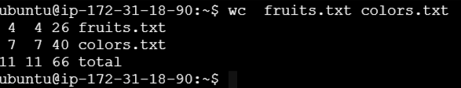

Reference: [Linux Commands for DevOps Used Day-to-Day] (https://www.linkedin.com/feed/update/urn:li:activity:7353103469257412611/)