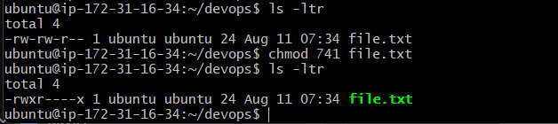
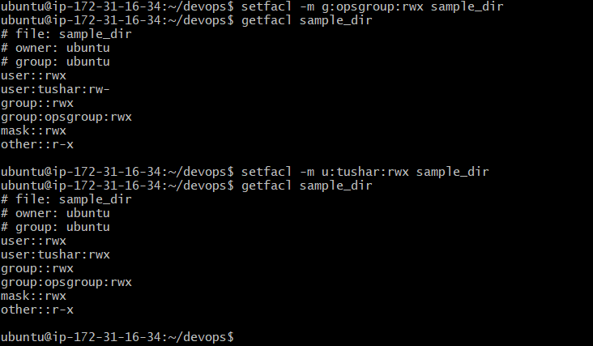
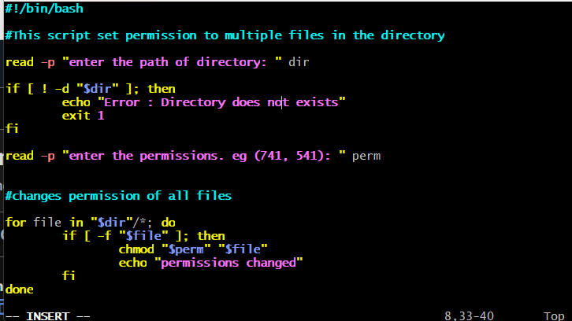
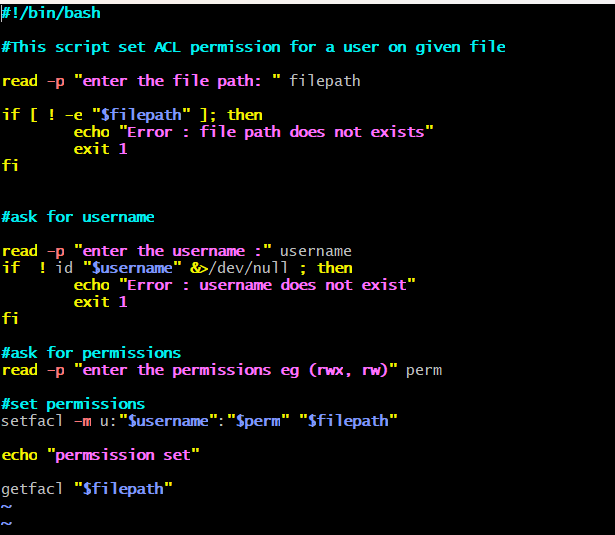
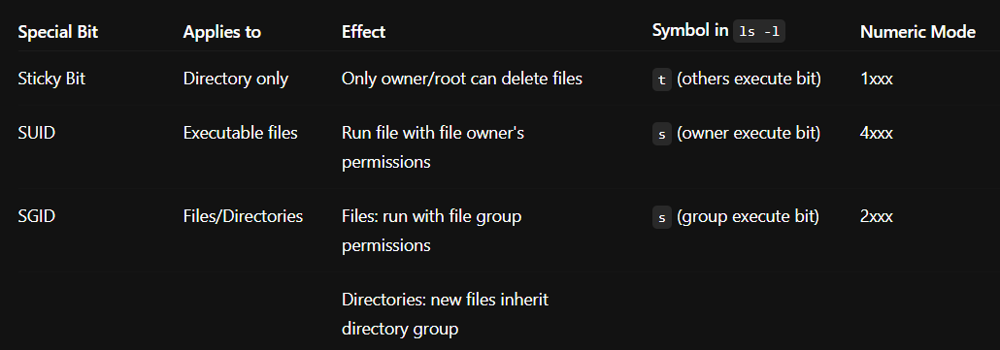
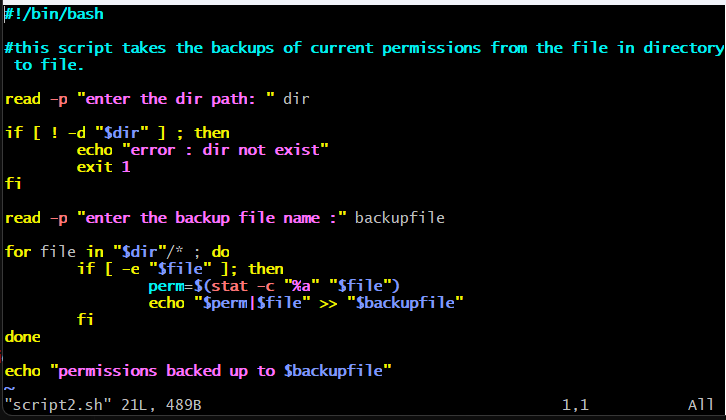
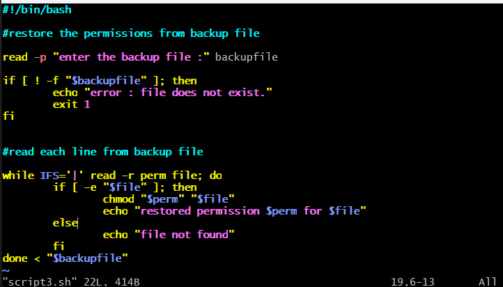

# Day 6 Answers : File Permissions and Access Control Lists

### Today is more on Reading, Learning, and Implementing File Permissions

The concept of Linux file permission and ownership is important in Linux. Today, we will work on Linux permissions and ownership, and perform tasks related to both.

## Tasks

1. **Understanding File Permissions:**
   - Create a simple file and run `ls -ltr` to see the details of the files. [Refer to Notes](https://github.com/LondheShubham153/90DaysOfDevOps/tree/master/2023/day06/notes)
   - Each of the three permissions are assigned to three defined categories of users. The categories are:
     - **Owner:** The owner of the file or application.
       - Use `chown` to change the ownership permission of a file or directory.
     - **Group:** The group that owns the file or application.
       - Use `chgrp` to change the group permission of a file or directory.
     - **Others:** All users with access to the system (outside the users in a group).
       - Use `chmod` to change the other users' permissions of a file or directory.
   - Task: Change the user permissions of the file and note the changes after running `ls -ltr`.

   - Answer : 

2. **Writing an Article:**
   - Write an article about file permissions based on your understanding from the notes.
   - The Three Categories of Users
Permissions in Linux are divided into three main categories, each controlling access differently:

Owner
The user who owns the file or directory. Typically, this is the user who created the file. Owners have special privileges to modify permissions and access.

Group
A file belongs to a group of users. All users in that group share the same group permissions. This is useful for collaboration within teams.

Others
All other users on the system who are neither the owner nor part of the group.

Types of Permissions
Each category is assigned three basic permissions:

Read (r): Allows viewing the contents of a file or listing contents of a directory.

Write (w): Allows modifying the contents of a file or adding/removing files in a directory.

Execute (x): Allows executing a file (if it’s a script or program) or accessing a directory.

3. **Access Control Lists (ACL):**
   - Read about ACL and try out the commands `getfacl` and `setfacl`.
   - Task: Create a directory and set specific ACL permissions for different users and groups. Verify the permissions using `getfacl`.
   Answer : 

4. **Additional Tasks:**
   - **Task:** Create a script that changes the permissions of multiple files in a directory based on user input.
   

   - **Task:** Write a script that sets ACL permissions for a user on a given file, based on user input.
   

   
5. **Understanding Sticky Bit, SUID, and SGID:**
   - Read about sticky bit, SUID, and SGID.
   - Task: Create examples demonstrating the use of sticky bit, SUID, and SGID, and explain their significance.
   
   

6. **Backup and Restore Permissions:**
   - Task: Create a script that backs up the current permissions of files in a directory to a file.
   

   - Task: Create another script that restores the permissions from the backup file.
    
