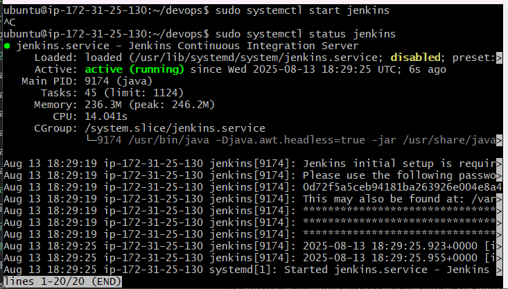
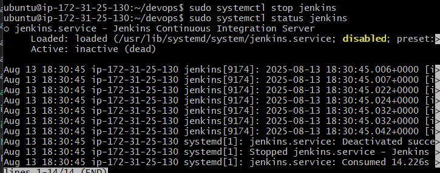
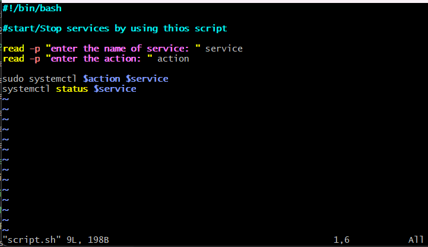
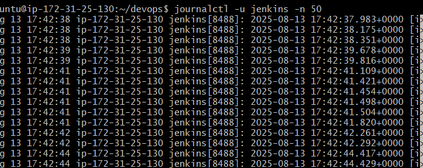

# Day 7 Answers : Understanding Package Manager and Systemctl

### What is a Package Manager in Linux?

In simpler words, a package manager is a tool that allows users to install, remove, upgrade, configure, and manage software packages on an operating system. The package manager can be a graphical application like a software center or a command line tool like apt-get or pacman.

You’ll often find me using the term ‘package’ in tutorials and articles. To understand a package manager, you must understand what a package is.

### What is a Package?

A package is usually referred to as an application but it could be a GUI application, command line tool, or a software library (required by other software programs). A package is essentially an archive file containing the binary executable, configuration file, and sometimes information about the dependencies.

### Different Kinds of Package Managers

Package managers differ based on the packaging system but the same packaging system may have more than one package manager.

For example, RPM has Yum and DNF package managers. For DEB, you have apt-get, aptitude command line-based package managers.

## Tasks

1. **Install Docker and Jenkins:**
   - Install Docker and Jenkins on your system from your terminal using package managers.
   

   

2. **Write a Blog or Article:**
   - Write a small blog or article on how to install these tools using package managers on Ubuntu and CentOS.
   Managing software installations efficiently is a core skill for any Linux user or system administrator. Two of the most common package managers are APT for Ubuntu/Debian systems and YUM/DNF for CentOS/RHEL. In this article, we’ll go through installing essential tools using these package managers.
   - Using APT on Ubuntu
Ubuntu and other Debian-based distributions use the apt or apt-get package manager. It handles downloading, installing, updating, and removing software packages from repositories.

### Systemctl and Systemd

Systemctl is used to examine and control the state of the “systemd” system and service manager. Systemd is a system and service manager for Unix-like operating systems (most distributions, but not all).

## Tasks

1. **Check Docker Service Status:**
   - Check the status of the Docker service on your system (ensure you have completed the installation tasks above).
      

2. **Manage Jenkins Service:**
   - Stop the Jenkins service and post before and after screenshots.
   Before :
   

   After :
   

3. **Read About Systemctl vs. Service:**
   - Read about the differences between the `systemctl` and `service` commands.
   - Example: `systemctl status docker` vs. `service docker status`.

Answer : systemctl is the modern systemd interface, offering advanced controls, startup settings, and integrated logging.

     service is older, simpler, and works with SysV init scripts.
     Example:

     systemctl status docker
     service docker status
     While both can check service status, systemctl provides richer and more detailed output.

   For reference, read [this article](https://www.howtogeek.com/devops/how-to-check-if-the-docker-daemon-or-a-container-is-running/#:~:text=Checking%20With%20Systemctl&text=Check%20what%27s%20displayed%20under%20%E2%80%9CActive,running%20sudo%20systemctl%20start%20docker%20).

### Additional Tasks

4. **Automate Service Management:**
   - Write a script to automate the starting and stopping of Docker and Jenkins services.
      

5. **Enable and Disable Services:**
   - Use systemctl to enable Docker to start on boot and disable Jenkins from starting on boot.
   

6. **Analyze Logs:**
   - Use journalctl to analyze the logs of the Docker and Jenkins services. Post your findings.
   

   

