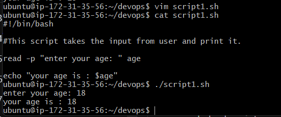
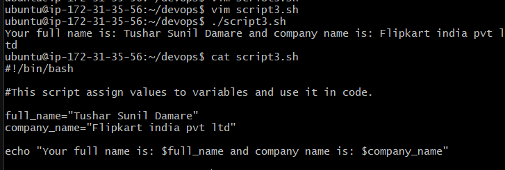
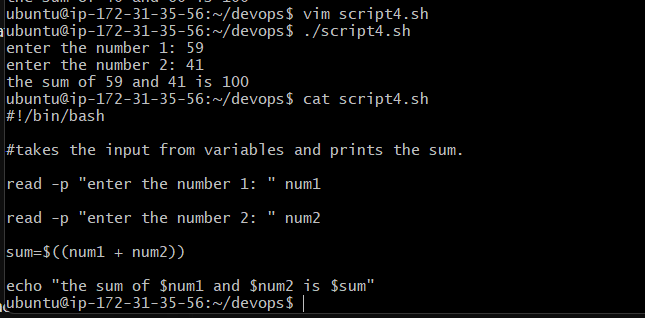
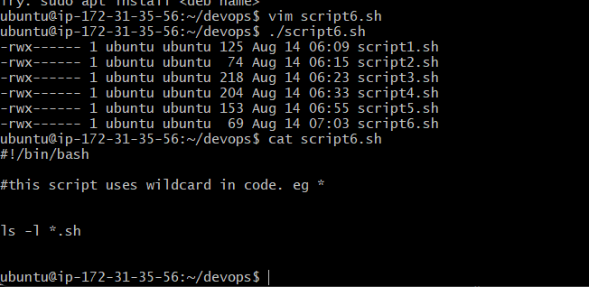
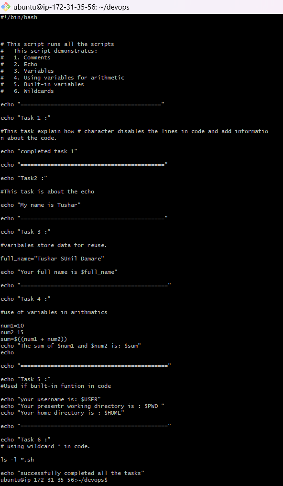

# Day 8 Answers: Shell Scripting Challenge

### Task 1: Comments
In bash scripts, comments are used to add explanatory notes or disable certain lines of code. Your task is to create a bash script with comments explaining what the script does.

### Task 2: Echo
The echo command is used to display messages on the terminal. Your task is to create a bash script that uses echo to print a message of your choice.

### Task 3: Variables
Variables in bash are used to store data and can be referenced by their name. Your task is to create a bash script that declares variables and assigns values to them.

### Task 4: Using Variables
Now that you have declared variables, let's use them to perform a simple task. Create a bash script that takes two variables (numbers) as input and prints their sum using those variables.

### Task 5: Using Built-in Variables
Bash provides several built-in variables that hold useful information. Your task is to create a bash script that utilizes at least three different built-in variables to display relevant information.

### Task 6: Wildcards
Wildcards are special characters used to perform pattern matching when working with files. Your task is to create a bash script that utilizes wildcards to list all the files with a specific extension in a directory.

## Submission Instructions:
- Create a single bash script that completes all the tasks mentioned above.
- Add comments at appropriate places to explain what each part of the script does.
- Ensure that your script is well-documented and easy to understand.
- To submit your entry, create a GitHub repository and commit your script to it.
