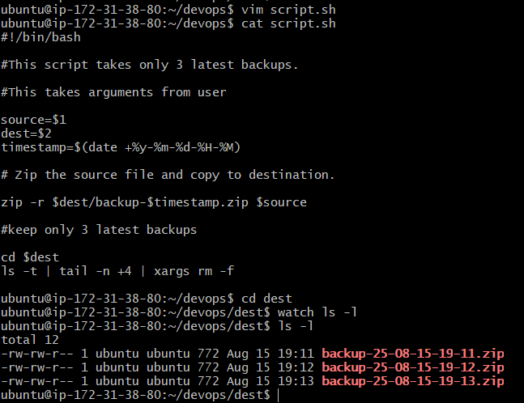

Solutions for challenge : 
Your task is to create a bash script that takes a directory path as a command-line argument and performs a backup of the directory. The script should create timestamped backup folders and copy all the files from the specified directory into the backup folder.

Additionally, the script should implement a rotation mechanism to keep only the last 3 backups. This means that if there are more than 3 backup folders, the oldest backup folders should be removed to ensure only the most recent backups are retained.

> The script will create a timestamped backup folder inside the specified directory and copy all the files into it. It will also check for existing backup folders and remove the oldest backups to keep only the last 3 backups.

