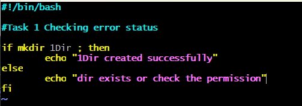
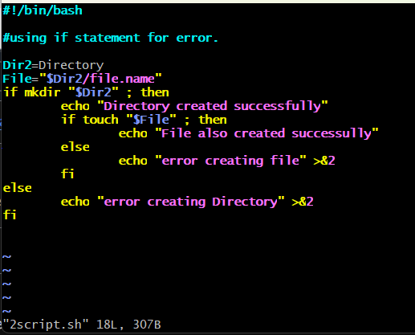
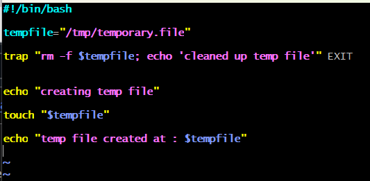
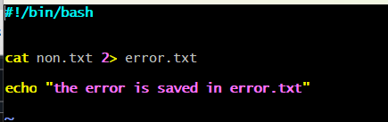
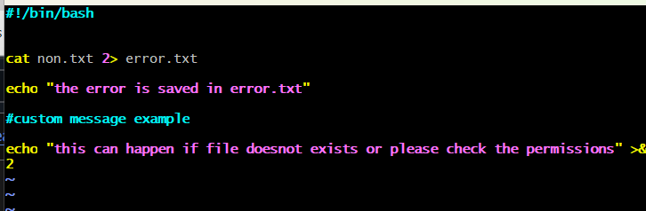

### Task 1: Checking Exit Status
- Write a script that attempts to create a directory and checks if the command was successful. If not, print an error message.

### Task 2: Using `if` Statements for Error Checking
- Modify the script from Task 1 to include more commands (e.g., creating a file inside the directory) and use `if` statements to handle errors at each step.

### Task 3: Using `trap` for Cleanup
- Write a script that creates a temporary file and sets a `trap` to delete the file if the script exits unexpectedly.

### Task 4: Redirecting Errors
- Write a script that tries to read a non-existent file and redirects the error message to a file called `error.log`.

### Task 5: Creating Custom Error Messages
- Modify one of the previous scripts to include custom error messages that provide more context about what went wrong.
