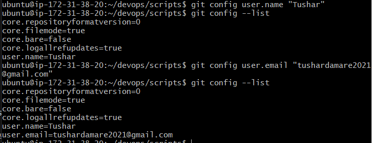
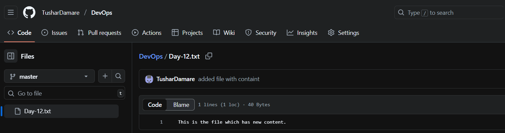
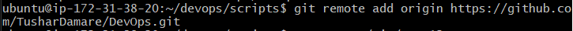
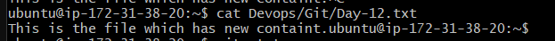
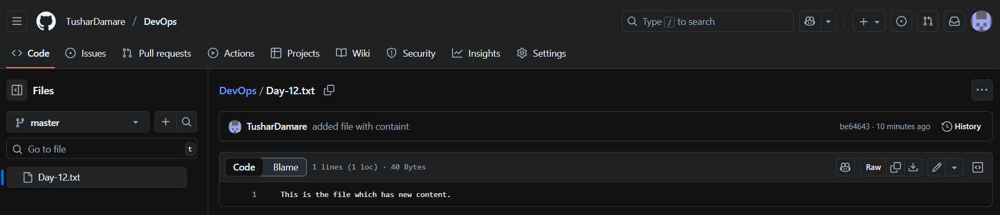

# Day 12 Answers: Deep Dive in Git & GitHub for DevOps Engineers

## Find the answers by your understandings (Shouldn't be copied from the internet & use hand-made diagrams) of the questions below and write a blog on it.

1. What is Git and why is it important?
2. What is the difference between Main Branch and Master Branch?
3. Can you explain the difference between Git and GitHub?
4. How do you create a new repository on GitHub?
5. What is the difference between a local & remote repository? How to connect local to remote?

1. Git is a distributed version control system. Think of it like a time machine for your code. Every time you make changes, you can save (commit) them, and Git remembers those snapshots. This way, you can:

-Revert to old versions if something breaks.
-Work on new features without disturbing the main code.
-Collaborate with teammates without overwriting each other’s work.

Why it’s important for DevOps:

-Keeps track of infrastructure-as-code changes.
-Helps in CI/CD pipelines by versioning deployment scripts.
-Makes teamwork smoother with branching and merging.

2. Main Branch vs Master Branch

Both main and master are just names for the default branch in Git.
Originally, Git used master.

Platforms like GitHub now use main as the default (more inclusive naming).

👉 Functionally, there’s no difference. It’s just a label. Teams can rename branches as they wish.

3. Git vs GitHub

-Git: A tool installed on your local machine. It tracks versions of your code. You can use Git without the internet.
-GitHub: A cloud-based platform that hosts Git repositories. It makes sharing, collaboration, and project management easier.

💡 Think of it this way:

-Git = your personal notebook of code history.
-GitHub = an online library where you publish that notebook so others can read or contribute.

4. How to Create a New Repository on GitHub

Steps:

-Log in to GitHub.
-Click the + New Repository button.
-Enter repository name, description, choose public/private.
-(Optional) Add README, .gitignore.
-Click Create Repository.

That’s it — you now have an empty GitHub repo ready to connect to your local machine.

5. Local vs Remote Repository & Connecting Them

-Local Repository: The Git repo on your computer. You initialize it with git init.
-Remote Repository: The Git repo hosted on GitHub (or GitLab/Bitbucket).

commands:
# Initialize Git locally
-git init
# Add remote origin (GitHub repo link)
-git remote add origin https://github.com/username/repo.git
# Add and commit changes
-git add .
-git commit -m "Initial commit"
# Push to GitHub
-git push -u origin main # or master, depending on branch name

## Tasks

### Task 1:
- Set your user name and email address, which will be associated with your commits.

### Task 2:

- Create a repository named "DevOps" on GitHub.

- Connect your local repository to the repository on GitHub.

- Create a new file in Devops/Git/Day-12.txt & add some content to it.

- Push your local commits to the repository on GitHub.

