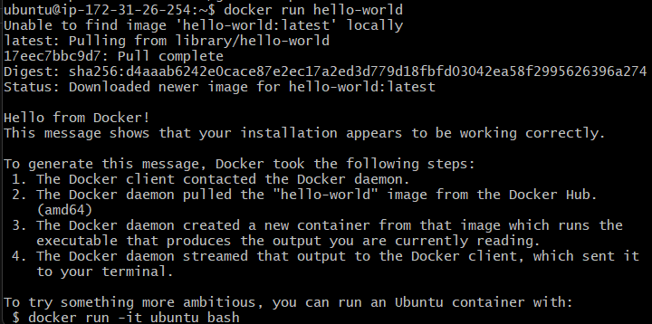
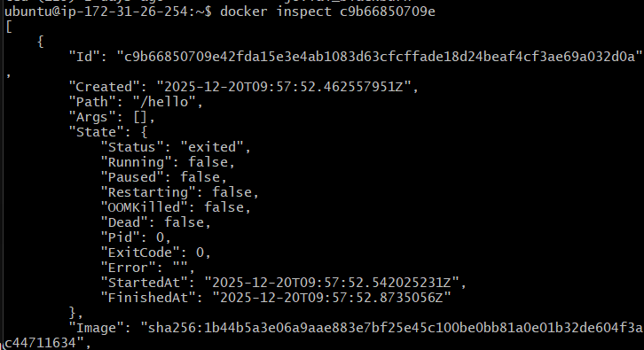
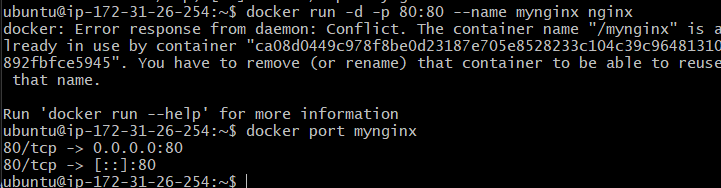
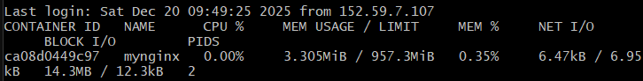
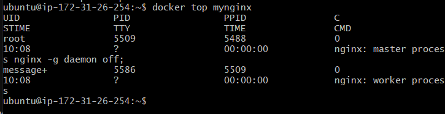
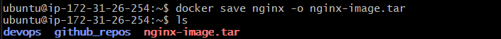
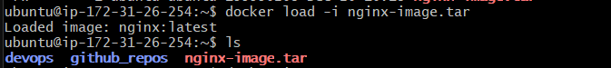

# Day 16 Answer: Docker for DevOps Engineers

### Docker

Docker is a software platform that allows you to build, test, and deploy applications quickly. Docker packages software into standardized units called containers that have everything the software needs to run, including libraries, system tools, code, and runtime. Using Docker, you can quickly deploy and scale applications into any environment and know your code will run.

## Tasks

As you have already installed Docker in previous tasks, now is the time to run Docker commands.

1- Use the `docker run` command to start a new container and interact with it through the command line. [Hint: `docker run hello-world`]
Answer : 

2- Use the `docker inspect` command to view detailed information about a container or image.
Answer : 

3- Use the `docker port` command to list the port mappings for a container.
Answer : 

4- Use the `docker stats` command to view resource usage statistics for one or more containers.
Answer : 

5- Use the `docker top` command to view the processes running inside a container.
Answer : 

6- Use the `docker save` command to save an image to a tar archive.
Answer : 

7- Use the `docker load` command to load an image from a tar archive.
Answer : 

These tasks involve simple operations that can be used to manage images and containers.
