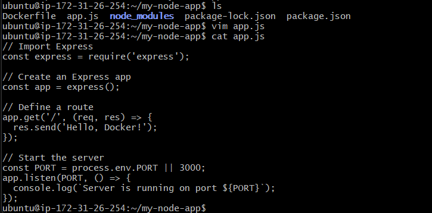
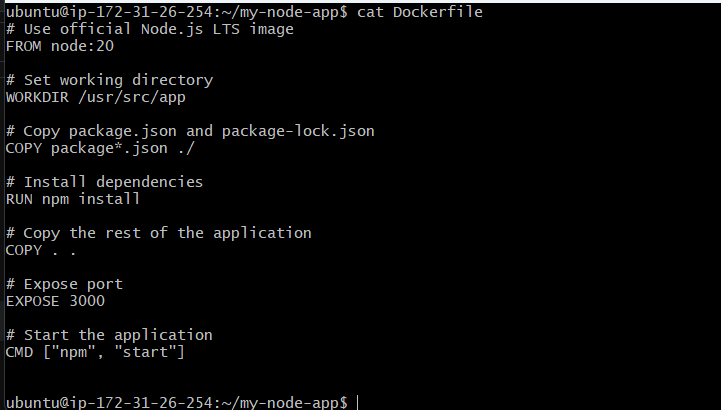
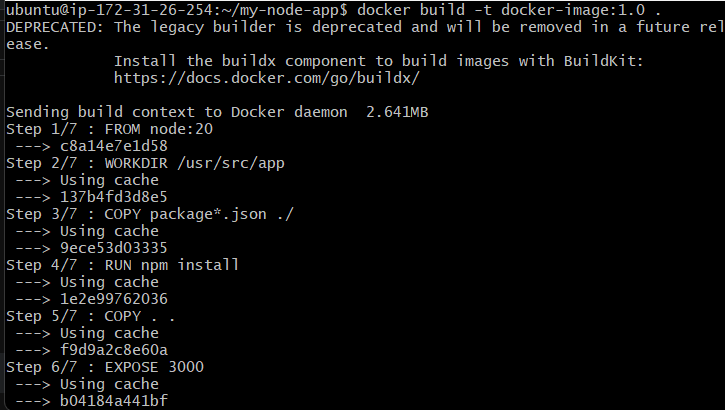
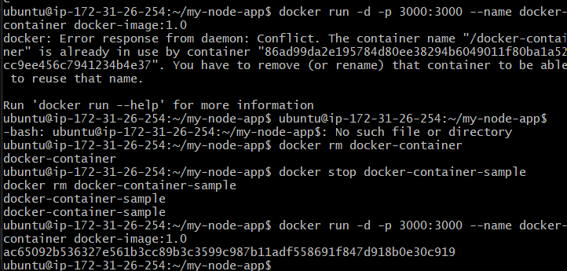
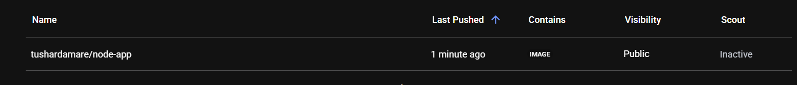

## Day 17 Task: Docker Project for DevOps Engineers

### You people are doing just amazing in **#90daysofdevops**. Today's challenge is so special because you are going to do a DevOps project with Docker. Are you excited? 😍

# Dockerfile

Docker is a tool that makes it easy to run applications in containers. Containers are like small packages that hold everything an application needs to run. To create these containers, developers use something called a Dockerfile.

A Dockerfile is like a set of instructions for making a container. It tells Docker what base image to use, what commands to run, and what files to include. For example, if you were making a container for a website, the Dockerfile might tell Docker to use an official web server image, copy the files for your website into the container, and start the web server when the container starts.

For more about Dockerfile, visit [here](https://rushikesh-mashidkar.hashnode.dev/dockerfile-docker-compose-swarm-and-volumes).

## Task

- Create a Dockerfile for a simple web application (e.g. a Node.js or Python app)
Answer : 

- Build the image using the Dockerfile and run the container
Answer:

- Verify that the application is working as expected by accessing it in a web browser
Answer:

- Push the image to a public or private repository (e.g. Docker Hub)
Answer :

