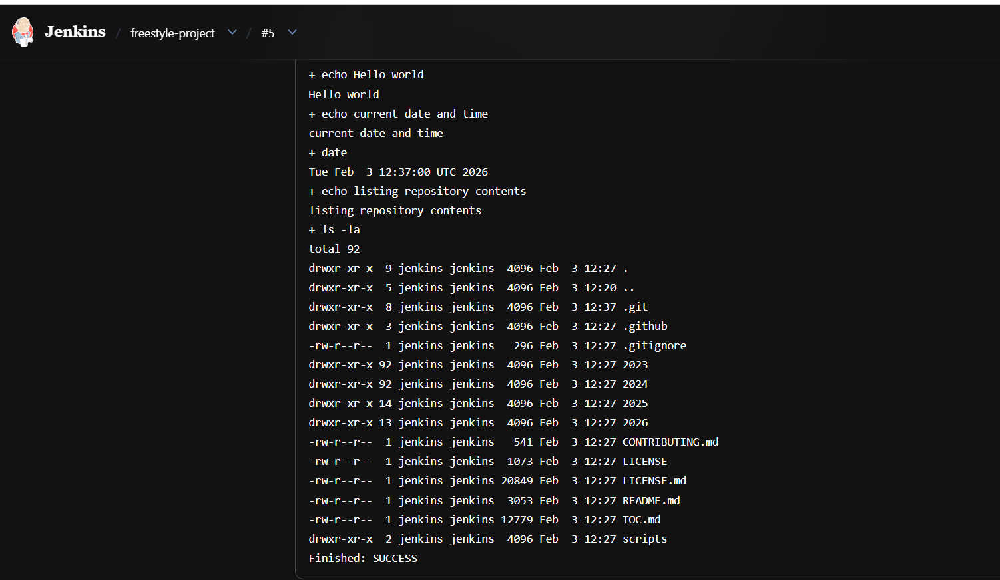

Answers: Day 22
--What is Jenkins and Why It Is Used

Jenkins is an open-source automation tool mainly used in software development to make repetitive technical tasks easier and faster. In real-world projects, developers frequently push code changes, and each change needs to be built, tested, and sometimes deployed. Doing this manually every time is time-consuming and error-prone. Jenkins solves this problem by automating these steps and ensuring consistency in the process.

Jenkins is widely used because it supports continuous integration and continuous delivery (CI/CD). It can be connected to version control systems like Git and automatically trigger jobs whenever new code is pushed. This helps teams identify issues early instead of discovering them at later stages of development. Since Jenkins is highly customizable and has a large plugin ecosystem, it can be adapted to different project requirements and technologies.
---------------------------------------------------------------------------------------------------------------

--Jenkins in the DevOps Lifecycle

In the DevOps lifecycle, Jenkins acts as a central automation engine that connects development and operations. It supports collaboration by ensuring that code changes are continuously integrated, tested, and delivered in a controlled manner. Jenkins fits naturally between the development phase and deployment phase, helping teams move faster while maintaining quality.

By automating repetitive tasks, Jenkins reduces manual intervention and minimizes human errors. This allows developers and operations teams to focus more on improving the application rather than managing builds and deployments. Jenkins also provides visibility into the pipeline through logs and build reports, which helps teams quickly understand failures and take corrective action.
---------------------------------------------------------------------------------------------------------------

--Role of Jenkins in Build, Test, and Deployment Automation

Jenkins plays a key role in automating the build process by compiling code and generating artifacts whenever a change is detected. After the build, it can automatically run different types of tests such as unit tests and integration tests to verify that the application works as expected. If any test fails, Jenkins immediately notifies the team, preventing faulty code from moving forward.

For deployment, Jenkins can be configured to deploy applications to test, staging, or production environments using tools like Docker, Kubernetes, or cloud platforms. This automation ensures faster and more reliable releases. Overall, Jenkins helps organizations deliver software more frequently, with better stability and improved confidence in each release.
-------------------------------------------------------------------------------------------------------------------

Answer 2 :

