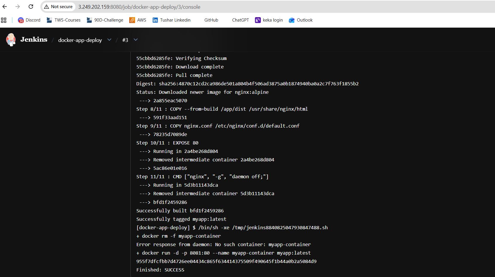
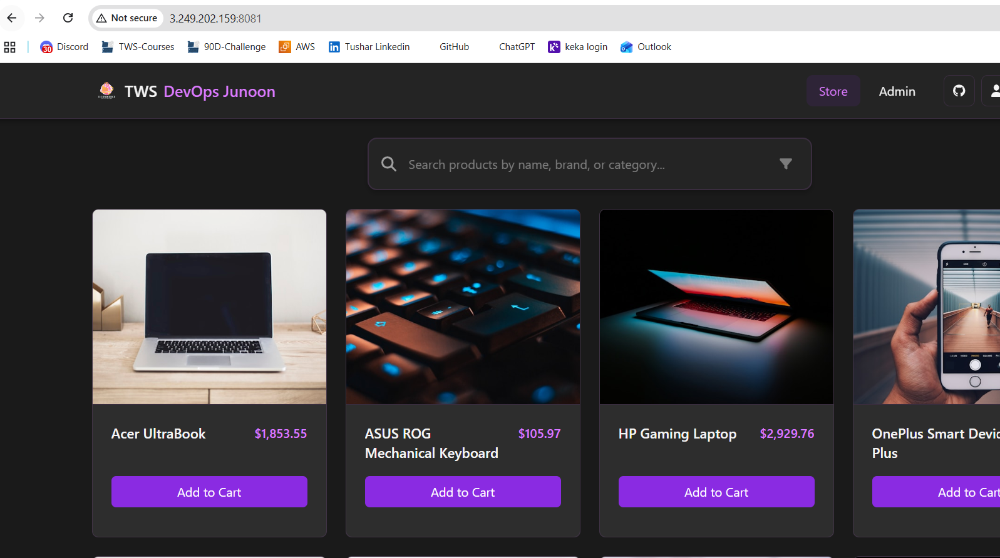

Day-23 Answers:

### Task 1

- Create an agent for your app (which you deployed using Docker in a previous task).
- Create a new Jenkins freestyle project for your app.
- In the "Build" section of the project, add a build step to run the `docker build` command to build the image for the container.
- Add a second step to run the `docker run` command to start a container using the image created in the previous step.

Answer :

App is running successfully :

===================================================================================================================
### Task 2

- Create a Jenkins project to run the `docker-compose up -d` command to start multiple containers defined in the compose file (Hint: use the application and database docker-compose file from Day 19).
- Set up a cleanup step in the Jenkins project to run the `docker-compose down` command to stop and remove the containers defined in the compose file.

