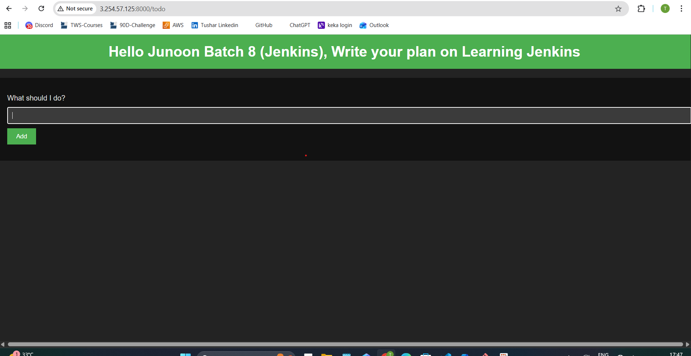
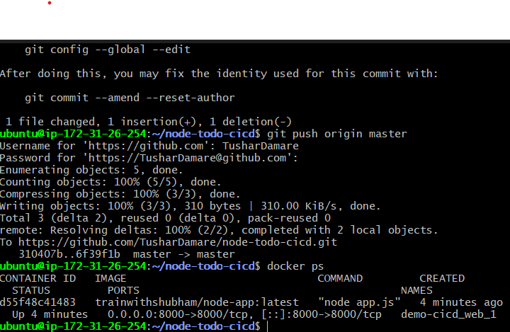
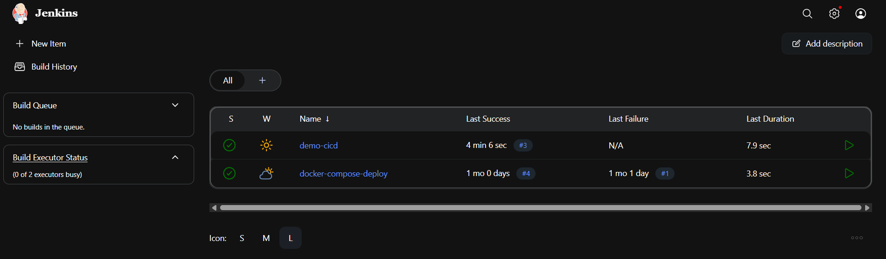
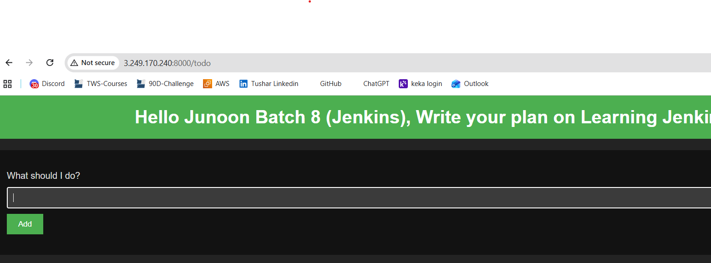

# Day 24 Answer: Complete Jenkins CI/CD Project

Let's create a comprehensive CI/CD pipeline for your Node.js application! 😍

## Did you finish Day 23?

- Day 23 focused on Jenkins CI/CD, ensuring you understood the basics. Today, you'll take it a step further by completing a full project from start to finish, which you can proudly add to your resume. 
- As you've already worked with Docker and Docker Compose, you'll be integrating these tools into a live project.

## Task 1

1. Fork [this repository](https://github.com/LondheShubham153/node-todo-cicd.git).
2. Set up a connection between your Jenkins job and your GitHub repository through GitHub Integration.
3. Learn about [GitHub WebHooks](https://betterprogramming.pub/how-too-add-github-webhook-to-a-jenkins-pipeline-62b0be84e006) and ensure you have the CI/CD setup configured.

Answer : Successfully followed all the steps and app is running.

===================================================================================================

## Task 2

1. In the "Execute Shell" section of your Jenkins job, run the application using Docker Compose.
2. Create a Docker Compose file for this project (a valuable open-source contribution).
3. Run the project and celebrate your accomplishment! 🎉

Answer : completed task 2 succesffuly. 

You can post on LinkedIn and share your experiences and learnings from this task using the #90DaysOfDevOps Challenge.

**Happy Learning :)**

[← Previous Day](../day23/README.md) | [Next Day →](../day25/README.md)
