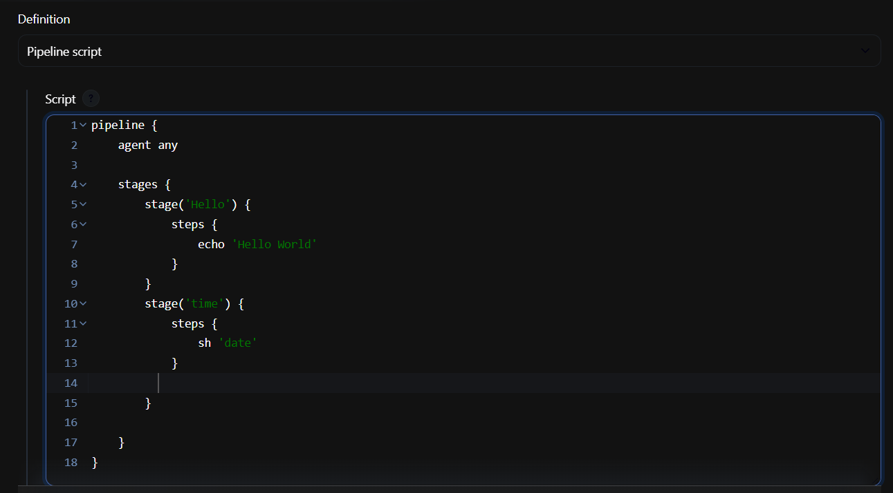
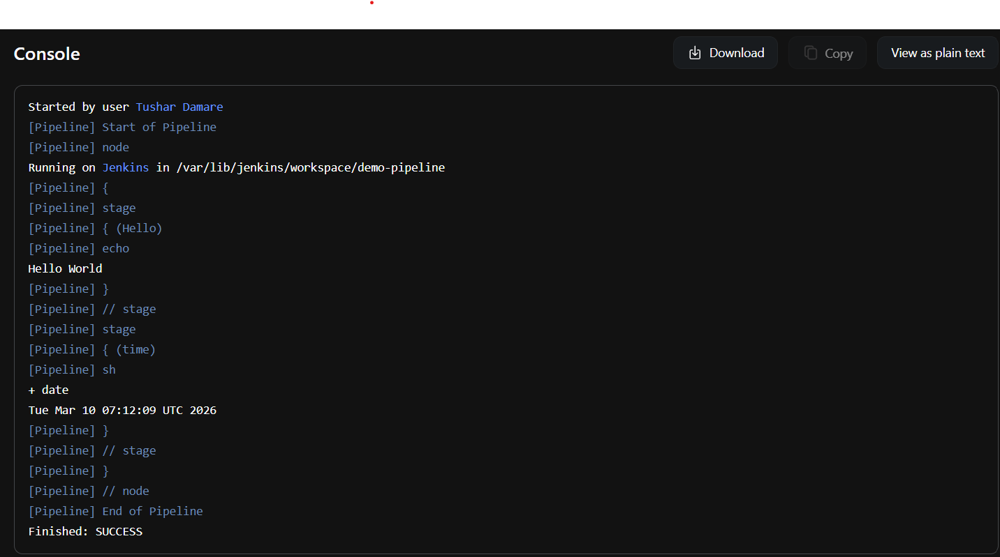

# Day 26 Answer: Jenkins Declarative Pipeline

# Task-01

- Create a New Job, this time select Pipeline instead of Freestyle Project.
- Follow the Official Jenkins [Hello world example](https://www.jenkins.io/doc/pipeline/tour/hello-world/)
- Complete the example using the Declarative pipeline

Answer : 
Sample Pipeline:

Pipeline executed successfully:

