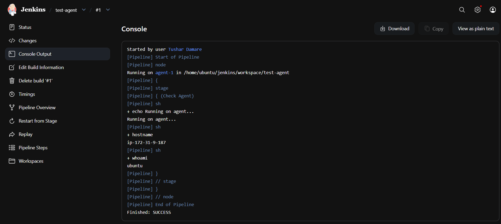
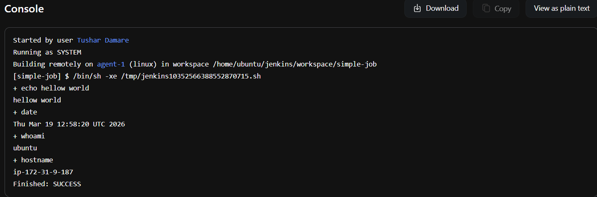

## Task 01

1. **Create an Agent:**
   - Set up a new node in Jenkins by creating an agent.

2. **AWS EC2 Instance Setup:**
   - Create a new AWS EC2 instance and connect it to the master (where Jenkins is installed).

3. **Master-Agent Connection:**
   - Establish a connection between the master and agent using SSH and a public-private key pair exchange.
   - Verify the agent's status in the "Nodes" section.

   Answer :

   ✔ Agent setup
✔ SSH connection
✔ Jenkins → Agent communication
✔ Pipeline execution on agent

===============================================================================================================================

## Task 02

1. **Run Previous Jobs on the New Agent:**
   - Use the agent to run the Jenkins jobs you built on Day 26 and Day 27.

2. **Labeling:**
   - Assign labels to the agent and configure your master server to trigger builds on the appropriate agent based on these labels.

Answer : I used Jenkins labels to control job execution on specific agents. I configured freestyle and pipeline jobs to run on targeted nodes based on workload requirements.

